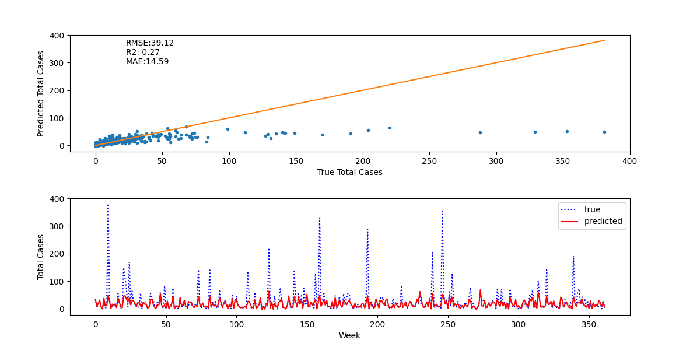
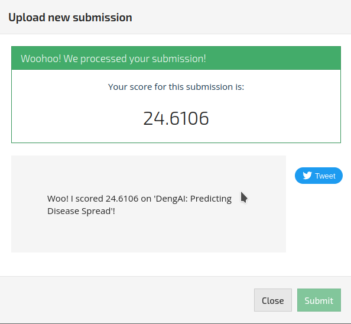
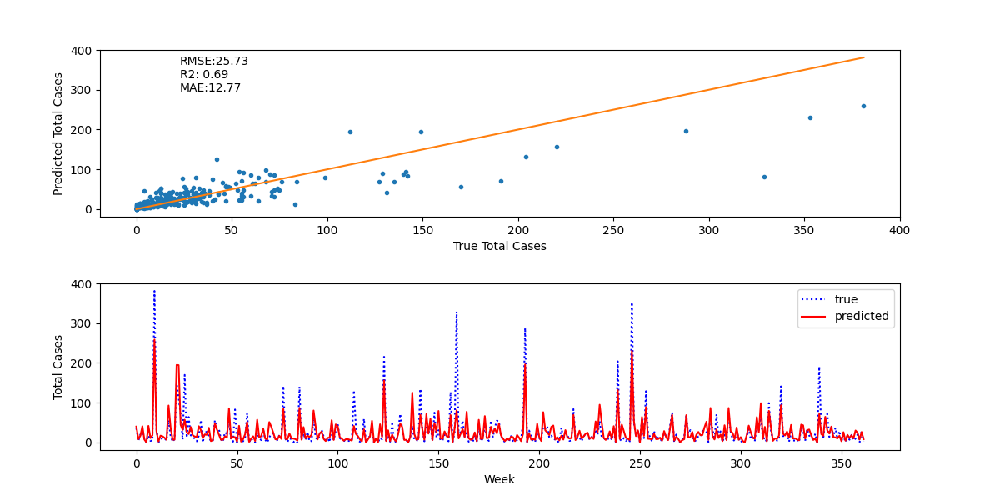
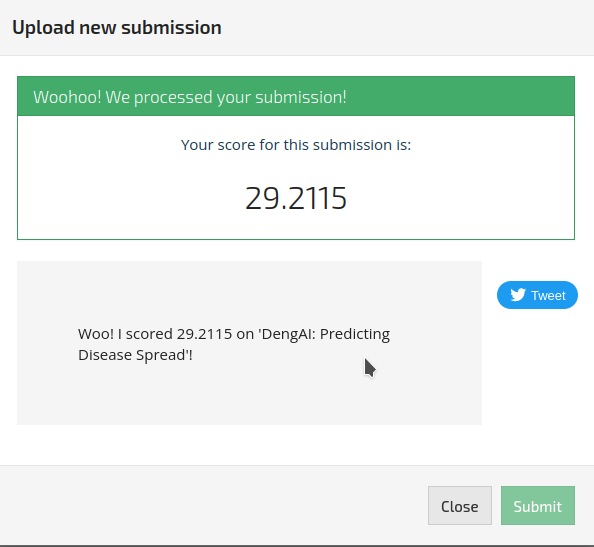

# General Intro

This is a machine learning project aimed at solving the 'DengAI: Predicting Disease Spread' competition at DrivenData 
(see: https://www.drivendata.org/competitions/44/dengai-predicting-disease-spread/page/82/).

The aim is to predict the *total_cases* (weekly total disease cases) in San Juan (Brazil) and Iquitos (Peru).
In this readme, we will describe the data, what has been done so far for data preprocessing and feature engineering,
two of the models we tried, the results and DD scores we obtained, followed by some discussion about these results and their implications.

## Data

Available feature data, and their descriptions are as follows:
- city – City abbreviations: sj for San Juan and iq for Iquitos
- week_start_date – Date given in yyyy-mm-dd format
- station_max_temp_c – Maximum temperature
- station_min_temp_c – Minimum temperature
- station_avg_temp_c – Average temperature
- station_precip_mm – Total precipitation
- station_diur_temp_rng_c – Diurnal temperature range
- precipitation_amt_mm – Total precipitation
- reanalysis_sat_precip_amt_mm – Total precipitation
- reanalysis_dew_point_temp_k – Mean dew point temperature
- reanalysis_air_temp_k – Mean air temperature
- reanalysis_relative_humidity_percent – Mean relative humidity
- reanalysis_specific_humidity_g_per_kg – Mean specific humidity
- reanalysis_precip_amt_kg_per_m2 – Total precipitation
- reanalysis_max_air_temp_k – Maximum air temperature
- reanalysis_min_air_temp_k – Minimum air temperature
- reanalysis_avg_temp_k – Average air temperature
- reanalysis_tdtr_k – Diurnal temperature range
- ndvi_se – Pixel southeast of city centroid
- ndvi_sw – Pixel southwest of city centroid
- ndvi_ne – Pixel northeast of city centroid
- ndvi_nw – Pixel northwest of city centroid

### Preprocessing

The raw dataset is quite gappy, as shown below:

| col name | type | value count | missing values |
| -------- | ---- | ----------- | -------------- | 
| city | object | 2 | 0 |
| year | int64 | 21 | 0 |
| weekofyear | int64 | 53 | 0 |
| week_start_date | object | 1049 | 0 |
| ndvi_ne | float64 | 1214 | 194 |
| ndvi_nw | float64 | 1365 | 52 |
| ndvi_se | float64 | 1395 | 22 |
| ndvi_sw | float64 | 1388 | 22 |
| precipitation_amt_mm | float64 | 1157 | 13 |
| reanalysis_air_temp_k | float64 | 1176 | 10 |
| reanalysis_avg_temp_k | float64 | 600 | 10 |
| reanalysis_dew_point_temp_k | float64 | 1180 | 10 |
| reanalysis_max_air_temp_k | float64 | 141 | 10 |
| reanalysis_min_air_temp_k | float64 | 117 | 10 |
| reanalysis_precip_amt_kg_per_m2 | float64 | 1039 | 10 |
| reanalysis_relative_humidity_percent | float64 | 1370 | 10 |
| reanalysis_sat_precip_amt_mm | float64 | 1157 | 13 |
| reanalysis_specific_humidity_g_per_kg | float64 | 1171 | 10 |
| reanalysis_tdtr_k | float64 | 519 | 10 |
| station_avg_temp_c | float64 | 492 | 43 |
| station_diur_temp_rng_c | float64 | 470 | 43 |
| station_max_temp_c | float64 | 73 | 20 |
| station_min_temp_c | float64 | 73 | 14 |
| station_precip_mm | float64 | 663 | 22 |

After the preprocessing (see **feature_eng.py**), this is how the features looked like:

| col name | type | value count | missing values |
| -------- | ---- | ----------- | -------------- |
| city | int64 | 2 | 0 |
| weekofyear | int64 | 52 | 0 |
| ndvi_ne | float64 | 1394 | 0 |
| ndvi_nw | float64 | 1405 | 0 |
| ndvi_se | float64 | 1407 | 0 |
| ndvi_sw | float64 | 1402 | 0 |
| reanalysis_dew_point_temp_k | float64 | 1180 | 0 |
| reanalysis_precip_amt_kg_per_m2 | float64 | 1039 | 0 |
| reanalysis_relative_humidity_percent | float64 | 1370 | 0 |
| reanalysis_specific_humidity_g_per_kg | float64 | 1171 | 0 |
| station_avg_temp_c | float64 | 521 | 0 |
| station_diur_temp_rng_c | float64 | 503 | 0 |
| station_max_temp_c | float64 | 82 | 0 |
| station_min_temp_c | float64 | 77 | 0 |
| station_precip_mm | float64 | 673 | 0 |
| total_cases | int64 | 134 | 0 |
| population_x | float64 | 30 | 0 |
| temp_dew | bool | 2 | 0 |
| temp_dew_l4 | bool | 2 | 0 |

## Model
The models, fitted hyperparameters (if available) and the GridSearch parameters can be found in **models.py**.
At this stage, following models are defined:
- sklearn.linear_model.LinearRegression
- sklearn.tree.DecisionTreeRegressor
- sklearn.ensemble.RandomForestRegressor
- sklearn.ensemble.GradientBoostingRegressor
- xgboost.XGBRegressor,XGBRFRegressor

In the following, we report the results obtained by Gradient Boosting Regression and Random Forest Regression.

### Gradient Boosting Regression (GBR)

After an iterative search for best parameters using the GridSearchCV function of sklearn (see **FPE.py**), 
the sub-test (test split of the train data) results did look really promising. The spikes, which is arguably the most critical characteristic, 
are not at all captured, as can be seen in the pseudo-time series plot (it shows the total cases in each row of the
test-split of the train data, with the two cities appended to each other). As a result, R2 and RMSE metrics are quite poor:

However, when this model is applied to the test data by submitting the results file (submission.csv) to the competition,
it got a mean absolute error (MAE, which is the chosen metric by the competition) of 24.6106, propelling us us into 897th position, 
in the top 8% of the total number of competitors (about 12K) at the current time:
.

### Random Forest Regression (RFR)

After a similar iterative search for the best parameters using GridSearchCV using the Random Forest Regression model,
we obtained relatively better looking results, when applied to the sub test, with a clearly higher R2, and better
ability to predict the spike corresponding to a sever outbreak of Dengue:

Interestingly, the submission file generated with this model returned a much lower score:

## Discussion
Based on these results, there are a few observations to be made. Perhaps, the metric for the competition has been poorly chosen: 
arguably what matters most is the ability of models to capture the large spikes, but the MAE is not good in penalizing models unable to capture these events.
It is equally possible that the test data does not exhibit the same behavior observed in the train data, be it for reasons present in the dataset (e.g., interactions between variables that we did not consider) or absent from it. In the latter case, predicting the spikes might be counterproductive in terms of score and we could remove them from the training data.
A final possibility is that our RFR model is somehow overfitted, although we do not capture this with our chosen train-test splits.

> Note: LightGBM has an option for Poisson regression (which should be more appropriate given the data). Neither LightGBM nor XGBoost provide an implementation for binomial.
